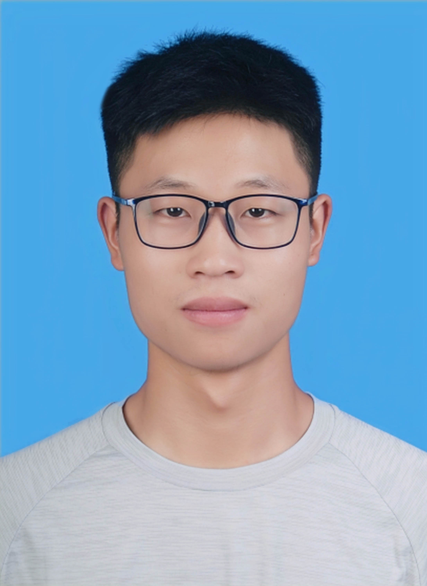

# 个人主页

  
*这是我的个人照片*

## 关于我

- **姓名**：王伟柳   
- **所在地**：杭州 
- **简介**：正在努力学习 LLM Safety!

## 技能

### 编程语言
- Python
- C/C++

## 教育背景

- **杭州电子科技大学** - 计算机科学与技术（2022-2026）  
  主修课程：数据结构、计算机网络、操作系统、计算机组成原理、算法分析与设计、Linux系统以及应用

## 项目经验

1. **全国大学生智能汽车竞赛模型组冠军**  
   - 使用 百度Edgeboard + 英飞凌TC264开发
   - 实现了智能车在特定赛道上的自动行驶
   - [coming soon！](coming soon！)

## 联系方式

- 📧 邮箱：22070125@hdu.edu.cn
- 🌐 网站：[www.yourwebsite.com](https://www.yourwebsite.com)  
- 💼 GitHub：[github.com/Wangweiliu](https://github.com/Wangweiliu)  
- 📱 微信：???

---

> "Stay hungry, stay foolish." - Steve Jobs